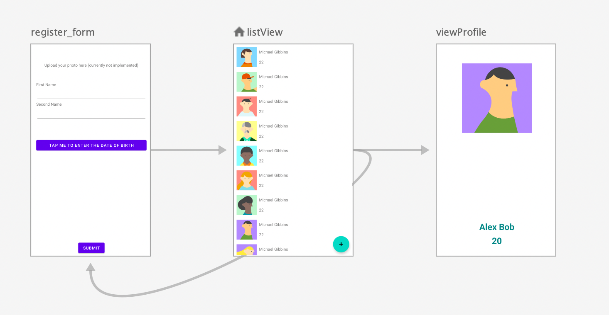

# Summary

## Architecture

The application is structured around 3 fragments with navigation graph described as following screenshot

The List screen (Fragment `AthleteList`) loads the data from a singleton instance of the `AthleteDatabase` class, which contains the list of `AthleteProfile` items. 

In order to render list items, List screen employs a `RecyclerView`. Individual item is clickable and the clicked item triggers a navigation action into the `ViewProfile` fragment. 

To add an athlete profile, user should press the "_+_" button in the home fragment. This button triggers a navigation action into the `AthleteRegister` fragment. Once user enters the data for the athlete, the `submit` button will create an `AthleteProfile` using the information and add the profile to the `database` instance, then triggers a navigation action back to the `AthleteList`.

## Data Layer

The implementation of Data facilities assumes following criteria:

1. O(n) operations like `List` should only happen once, in our case in the initialisation stage of the app. Common data access operations should always be constrained to O(1) complexity.
2. Ease of use: data object should be designed in such way that is both easy to create, store and access. 

To fulfill criterion 1, a singleton instance of data layer is used. This instance is initialised once at startup and shared by all accessor throughout the lifecycle. Underlying is an `ArrayList` data structure, due to the performant read access through integer index, used in `RecyclerView`; as well as `add` operation used by `AthleteRegister`. 

Considering profile data creation requires `firstName`, `secondName` and `dateOfBirth` information, and presentation (transformation) of these information can be trivially (O(1)) achieved, `AthleteProfile` is defined as a data class with a constructor requiring the aforementioned 3 pieces of information. Notably, `year: Int, month: Int, date: Int` is required for `dateOfBirth` because we can construct `java.util.Calendar` with these integers. With utilities like `DateFormat` the string formatting, as well as age calculation, can be easily built. 
